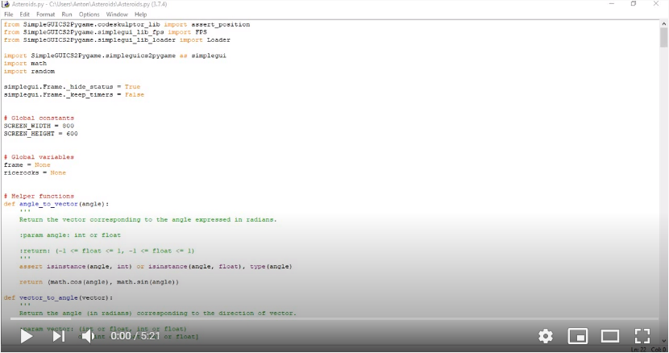

# Asteroids
Asteroids (Rice Rocks) is an analog of the space-theme shooter arcade game released in November 1979 by Atari, Inc.

This program is written on Python.

The project was completed by me in autumn 2014.

<h3>To see how this application works watch the demo video below.</h3>

